1. Выполним запросы для получения всех записей и создадим новые объекты:
 Добавим категорию
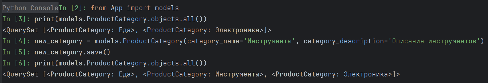
 Добавим товары
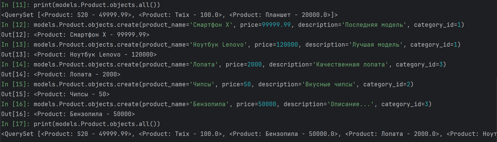
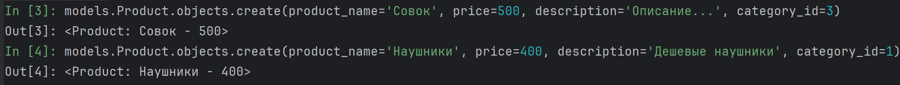
 Добавим заказ
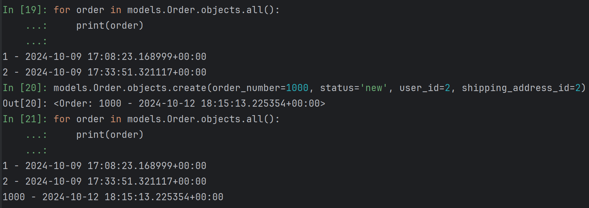
  Свяжем товар с заказом
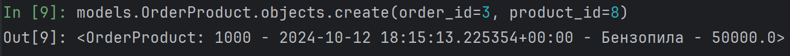
2. Используем методы filter(), exclude(), order_by():
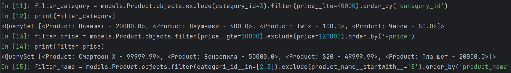
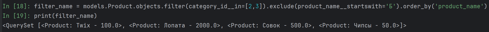
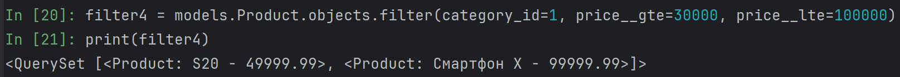
3. Выполним различные запросы используя в условиях связь
 Запрос всех заказов, сделанных определенным пользователем
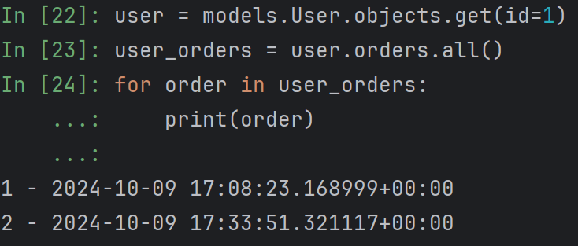
 Запрос всех продуктов, которые относятся к определенному заказу
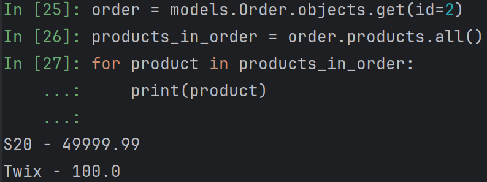
 Запрос всех заказов, у которых доставка в определённый город
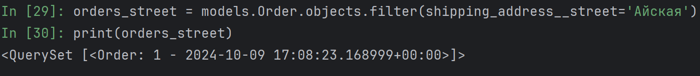
 values()
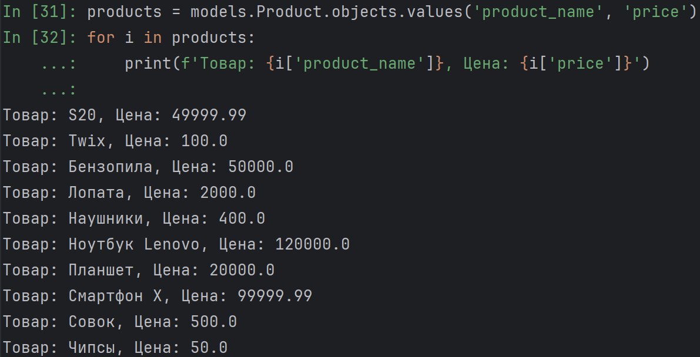
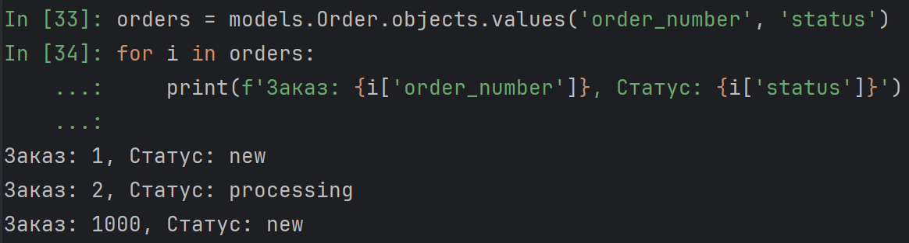
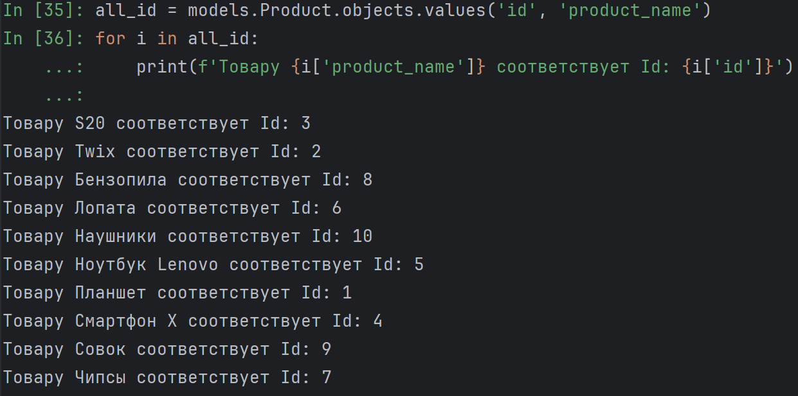
 values_list()
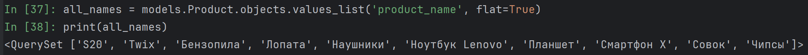
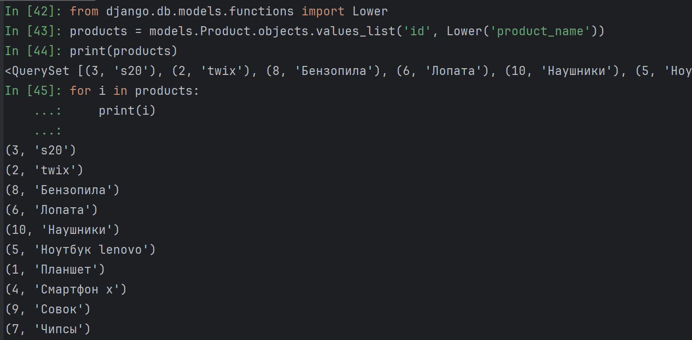
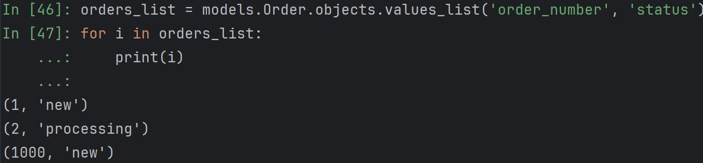
4. Используем Q объекты для сложных условий:
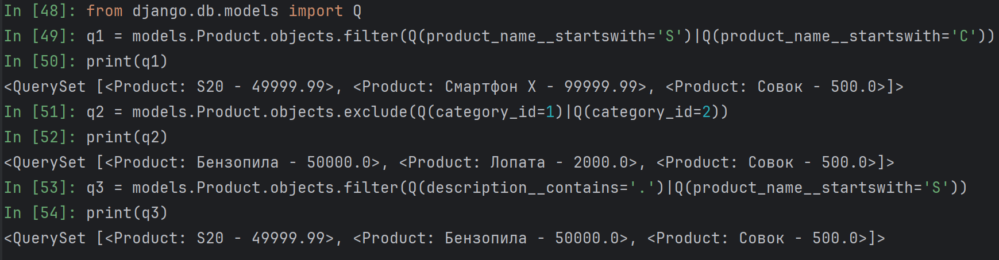
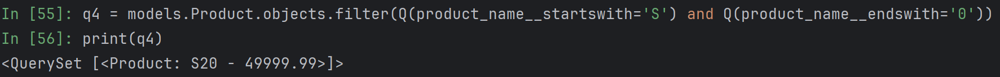
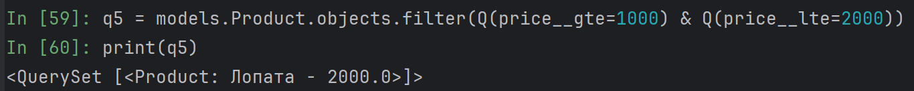
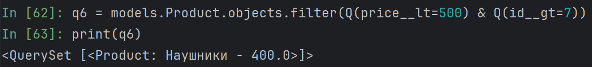
 Объединим условия так, чтобы одно из условий исключало записи, а другое — фильтровало их
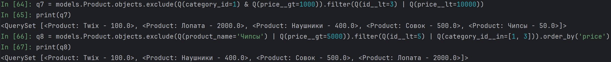
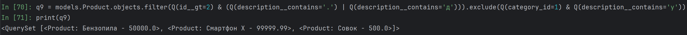
5. Используем методы annotate() и aggregate():
 annotate()
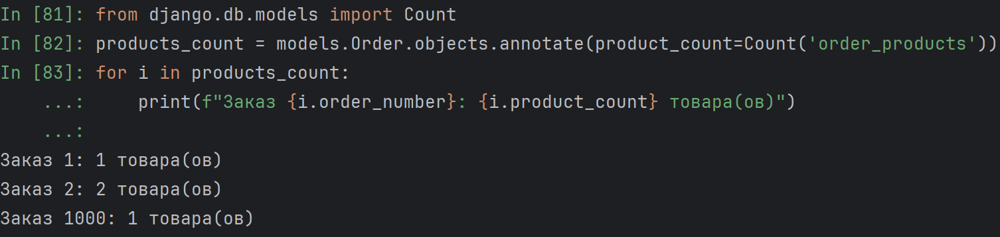
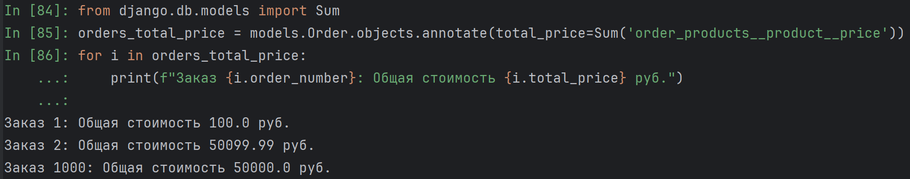
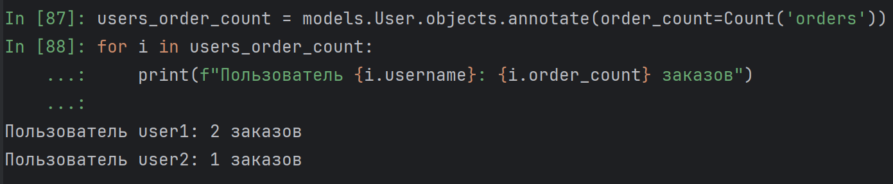
 aggregate()
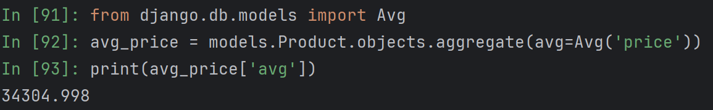
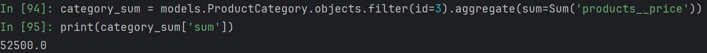
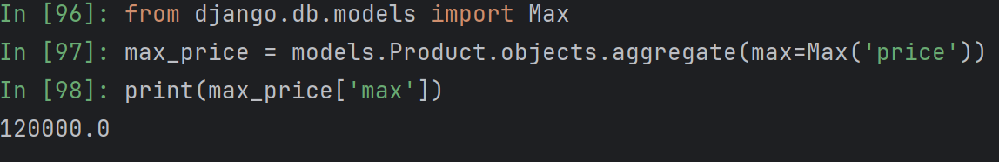